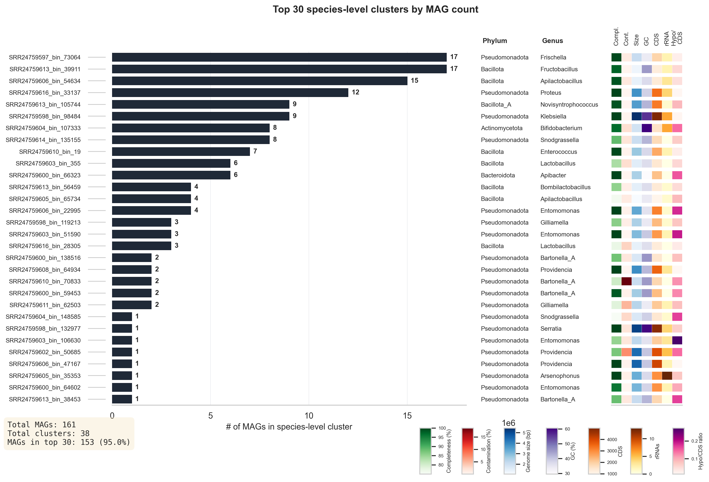
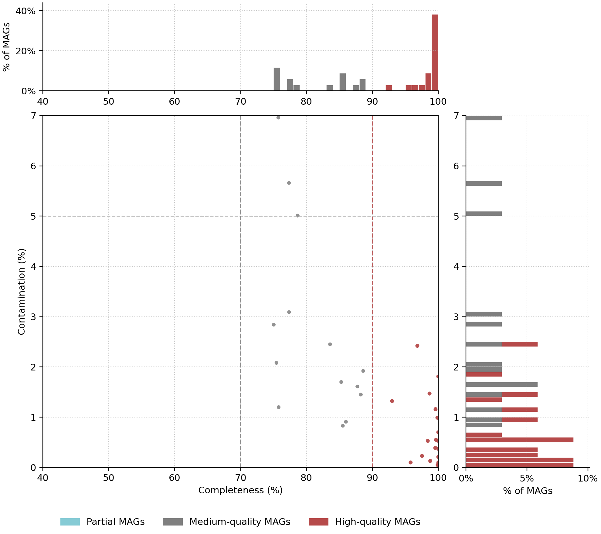

<p align="left">
  <h1 align="left">Visualizations of MAGs</h1>
  <p align="left">A toolkit for visualizing MAG quality, taxonomy, clustering, abundance patterns, and functional annotation.</p>
</p>

---

## Installation
This tool is distributed as a Python package with a command-line interface (CLI).

There are two main ways to install and use the tool:

- Recommended (users): install the package from source and use the command-line tool

- Alternative (developers): clone the repository and work on the code base


### Prerequisites

- Python ≥ 3.9
- Conda (Miniconda, Miniforge, Mambaforge)
- Git

### Option 1 (recommended): Install from source via pip
This is the recommended way to install and use the tool.

Clone the repository and change into the project directory:

```bash
git clone https://github.com/usegalaxy-eu/MAGs-visualization.git
cd MAGs-visualization
```

Install the package using pip:

```bash
pip install .
```

After installation, the command-line tool is available as:
```bash
mags-visualization --help
```

This method works independently of the repository structure.

### Option 2: Install from source (development/testing)
This option is intended for development, testing, or extending the code.

#### 2a: Conda / Mamba

```bash
git clone https://github.com/alexandrah1704/MAGs-visualization.git
cd MAGs-visualization
```

Create conda environment and activate it:

```bash
conda env create -f environment.yml
conda activate mags
pip install -e .
```

#### 2b: Python virtual environment (pip)

```powershell
# Change into project directory
cd MAGs-visualization

# Create virtual environment
python -m venv .venv

# Allow script execution for this session
Set-ExecutionPolicy -Scope Process -ExecutionPolicy Bypass

# Activate virtual environment
.\.venv\Scripts\Activate.ps1

# Install dependencies
pip install -e .
```

After installation, the command-line tool is available as:
```bash
mags-visualization --help
```

---

## What is this tool?

This tool generates a variety of visualizations for MAGs, including:

- Taxonomic Sankey diagrams
- Completeness/Contamination-Plots
- Heatmaps
- dRep cluster visualization with taxonomic annotation
- dRep cluster visualization with functional annotation (KEGG pathway completeness)
- Standalone KEGG pathway module heatmaps
- Rank distribution diagram...

All plots are saved in a user-defined output directory.

---

## Input files

Below are the inputs for a visualization run:

| Argument           | Description                           |
|--------------------|---------------------------------------|
| --coverm           | CoverM table                          |
| --checkm           | CheckM result file                    |
| --checkm2          | CheckM2 result file                   |
| --gtdb             | GTDB annotation table                 |
| --drep             | dRep cluster table                    |
| -o                 | Output folder for all generated plots |

Optional:

| Argument               | Description                           |
|------------------------|---------------------------------------|
| --quast                | QUAST assembly statistics             |
| --bakta                | Bakta annotation table                |
| --metadata             | Metadata table for coloring plots     |
| --metadata             | Metadata for heatmap visualization    |
| --amber                | CAMI Amber binning evaluation         |
| --pathways             | KEGG pathway completeness             |

### Input files per subcommand

#### sample-heatmap
- `--coverm` (required)
- `--gtdb` (required)
- `--metadata` (optional)
- `--meta_cols` (optional)

#### comp-conta
- `--checkm` (required)
- `--checkm2` (required)
- `--gtdb` (required for `--mode tax`)
- `--metadata` + `--meta_col` (required for `--mode meta`)

#### drep-cluster-annot
- `--drep` (required)
- `--gtdb` (required)
- `--checkm2`, `--quast`, `--bakta` (required for annotated heatmap)

#### drep-cluster-func
- `--drep` (required)
- `--gtdb` (required)
- `--pathways` (required for functional annotation heatmap)

#### pathway-module-heatmap
- `--drep` (required)
- `--gtdb` (required)
- `--pathways` (required)

#### taxa-sankey
- `--gtdb` (required)


## Command structure

The command-line interface is organized into **subcommands**.
Each subcommand generates exactly **one type of plot** and only shows the parameters relevant for that plot.

```bash
mags-visualization <subcommand> [OPTIONS]
```

Available subcommands:
- `sample-heatmap` - MAG detection heatmap per sample
- `drep-cluster-annot` - dRep cluster visualization with taxonomic/assembly annotation
- `drep-cluster-func` - dRep cluster overview with taxonomy and functional module heatmap
- `pathway-module-heatmap` - heatmap of KEGG pathway module completeness across MAGs
- `comp-conta` - completeness/contamination plots
- `taxa-sankey` - GTDB taxonomy sankey plots
- `all` - legacy mode running multiple plots in one command

The `all` subcommand is mainly intended for testing.
For Galaxy integration, the dedicated subcommands are recommended.

## Command-Line usage

### Show help
```bash
mags-visualization --help
```

### Show help for a specific plot
```bash
mags-visualization sample-heatmap --help
mags-visualization drep-cluster-annot --help
```

### Example: sample heatmap
```bash

mags-visualization sample-heatmap \
  --coverm test-data/coverm.tsv \
  --gtdb test-data/gtdb.tsv \
  --output out/sample-heatmap
```

### Example for test-data

```bash

mags-visualization all \
  --coverm test-data/coverm.tsv \
  --checkm test-data/checkm.tsv \
  --checkm2 test-data/checkm2.tsv \
  --gtdb test-data/gtdb.tsv \
  --drep test-data/drep.csv \
  --quast test-data/quast.tsv \
  --bakta test-data/bakta.tsv \
  --pathways test-data/kegg_pathway_completeness.tsv \
  --metadata test-data/metadata.tsv \
  --meta_cols "Infection by Nosema ceranae" "Chronic exposure to neonicotinoid" "Treatment with probiotic" \
  --color_by tax \
  --tax_level phylum \
  --top_n 30 \
  --top_bar_spacer -0.5 \
  --spacer_meta 2.5 \
  -o test-plots-run
```

### How to run automated test-script

```bash
python scripts/test-script.py
```


## Plot Configurations

### Taxonomic rank
```bash
--rank phylum
```

Available ranks:
```pgsql
domain, phylum, class, order, family, genus, species
```

### Top N taxa for plots
```bash
--top_n_counts 10
```
Minimum and Default = 5

### Plot size
```bash
--fig_size WIDTH HEIGHT
```

### Output format
```bash
--format png    # png, pdf or svg
```

### Coloring mode
```bash
--quality   # color points by quality categories hq, mq, lq
or
--color_by quality

--tax       # color by taxonomy

--color_by tax
--tax_level genus

--color_by meta  # color by metadata
--meta_col temperature  # weather or others
--meta_bin_width 5  # for numeric columns
```
To show in the heatmap more than one metadata column:
```bash
--meta_cols weather temp ground # example columns
```


## The following options are only available for specific subcommands

## Heatmap Options
### Plot features
```bash
--top_bar_height 0.8  # Height of top bar

--hspace 0.25 # Gap between top bar and heatmap

--heatmap_width 11.0

--spacer_legend 0.3 # Gap between legend and meta_bar

--spacer_meta 2.0 # Gap between meta_bar and heatmap

--spacer_heatmap # Gap between heatmap and histogram

--legend 2.5  # Size of legend

--meta_bar_add 1.5  # Additional width for meta_bar

--top_bar_spacer 0.0  # Gap between header and top bar

--max_col 10  # How many taxonomy names are shown (top 10)
```

## dRep Options
```bash
--top_n 30  # show top 30 clusters with most cluster members
```

## Examples
Full examples can be found in ['use-cases/README.md'](use-cases/README.md)

The examples include sample heatmaps, taxonomy sankey plots, completeness/contamination plots, and dRep cluster visualizations with functional annotation.

### dRep cluster plot



### Completeness/contamination plot

